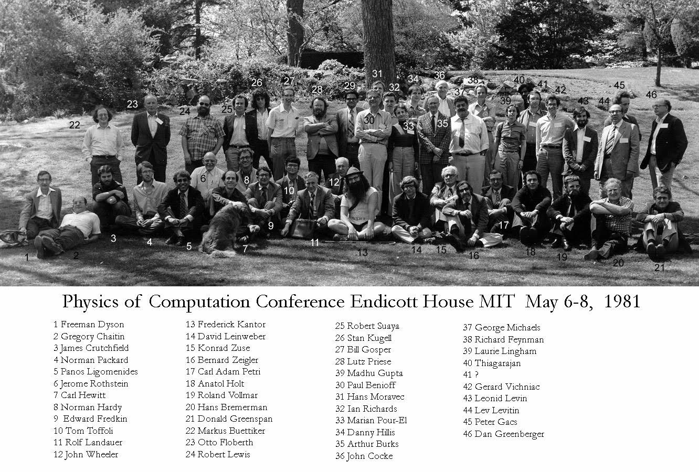
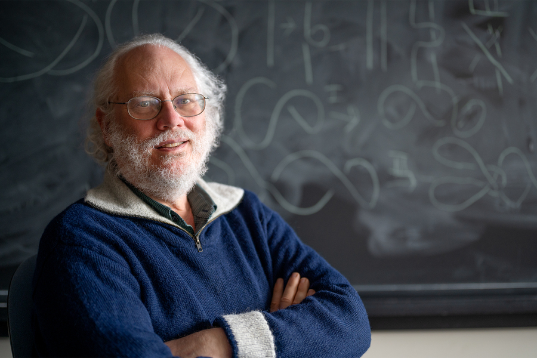
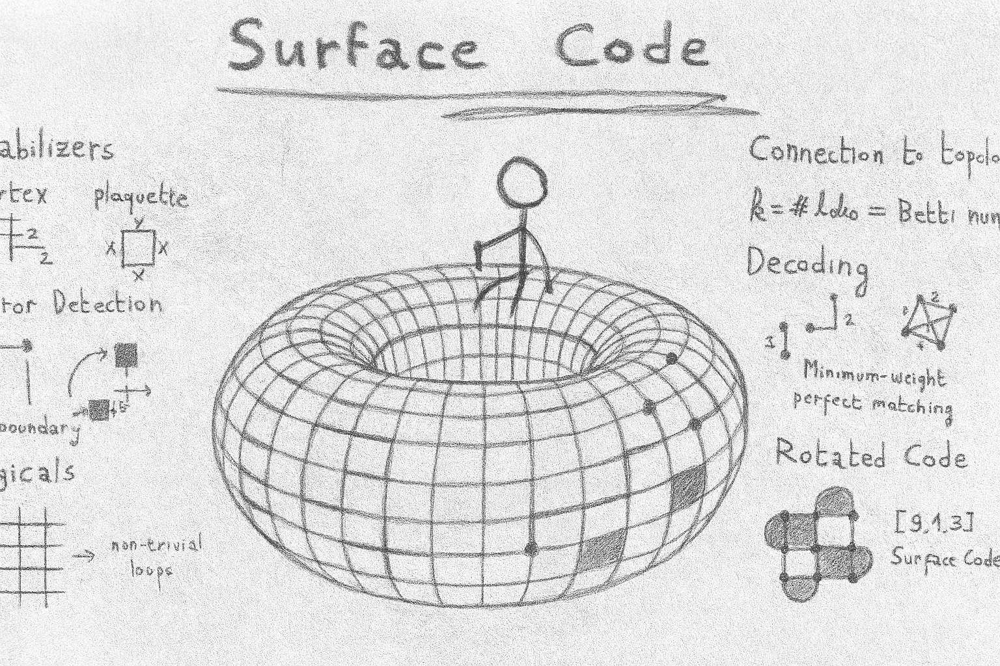
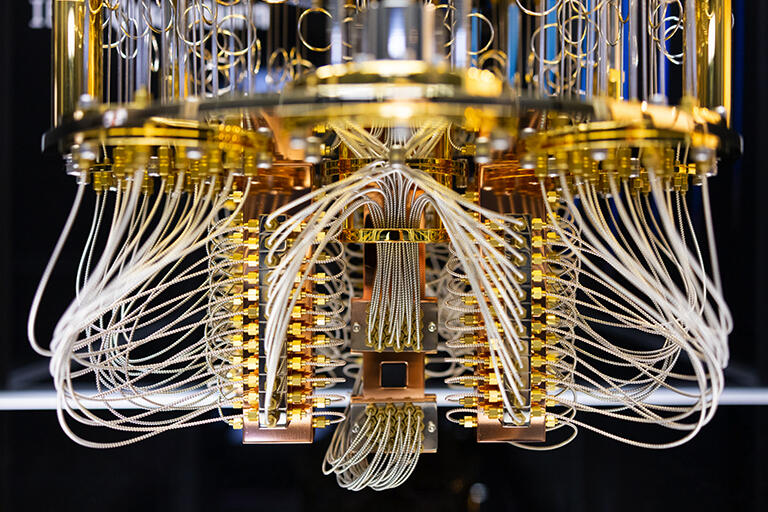

# Chapter 0.  The Machine That Dreams in Superposition

Before we dive into our quantum computing stack, let’s tip our hat to the strangeness that made it possible. This chapter isn’t a  detour—it’s a short trip upstream, to the headwaters of an idea. Before we write code, we’ll ask: what kind of machine were we trying to build in the first place, and why did anyone believe it could exist?

## The Age of Enlightenment (1980–1993)

Before a single qubit was trapped in a lab, before superconducting circuits hummed beneath cryogenic lids, quantum computing began—as many revolutions do— with a question.

In the early 1980s, a quiet transformation began in the minds of a few physicists. The world had long known the rules of quantum mechanics: particles existed in multiple states, collapsed under observation, and entangled in ways that defied locality. What hadn’t yet been considered seriously, however, was the possibility that **computation itself** might be quantum.

In 1980, Paul Benioff, a mathematical physicist working at Argonne National Lab, posed an elegant proposition: What if we modeled a Turing machine—the abstract engine behind all classical computing—using the principles of quantum mechanics? Could it be made reversible? Unitary? Benioff wasn’t trying to start a movement. He was interested in consistency: if the universe runs on quantum rules, then surely computation must as well. His model was quiet, meticulous, almost monastic in its restraint. But it suggested something radical: **you could, in principle, build a computer whose logic gates obeyed the Schrödinger equation** [(Benioff, 1980)](https://doi.org/10.1007/BF01011339).

But what would such a machine actually *do*? Enter Richard Feynman.

In 1981, at an MIT conference, Feynman did what Feynman did best: cut through the noise with a provocative question. *Why are we simulating quantum systems with classical computers?* he barked. "Nature isn’t classical, dammit—if you want to simulate nature, you’d better make it quantum."

<figure>
  
  <figcaption>
    The 1981 Physics of Computation Conference held at the historic 
    <a href="https://mitendicotthouse.org/physics-computation-conference/" target="_blank">MIT Endicott House</a>. 
    Image courtesy of MIT Endicott House.
  </figcaption>
</figure>

Classic Feynman: part rant, part roadmap. A year later, he spelled it out—quantum systems get exponentially more complex as you add particles [(Feynman, 1982)](https://doi.org/10.1007/BF02650179). Classical machines just couldn’t keep up. But quantum ones? Maybe.

Feynman wasn’t daydreaming about factoring primes or breaking RSA. He was after something messier: chemistry, condensed matter, quantum field theory. He wanted a machine that could speak nature’s native tongue. One that could **simulate the universe on its own terms**.

But, a computer should also do computation, right? That’s a natural question to ask—and by the mid-'80s, people finally started asking it. Maybe quantum machines weren’t just exotic physics toys. Maybe they could actually *compute*—faster, stranger, and more powerfully than classical ones.

David Deutsch thought so. He formalized the idea, naming the "universal quantum computer" [(Deutsch & Penrose, 1985)](https://doi.org/10.1098/rspa.1985.0070) and sketching what such a machine could be: a quantum Turing machine capable of simulating any physical process. But defining the machine was only half the story. What could it actually *do*?

By the early 1990s, a few theoretical blueprints began to trickle in. In 1992, Deutsch and Jozsa introduced the Deutsch–Jozsa algorithm [(Deutsch & Jozsa, 1992)](https://doi.org/10.1098/rspa.1992.0167)—a clever oracle problem where a quantum computer could determine, in a single step, something that would take a classical machine exponentially longer. It was a toy, but one that nobody sees before.

The door was cracked. The light was starting to leak in.

These were not yet the algorithms that would shake the world. But they cracked the door.

---

## The Shift to Power (1994–2000)

And then came the quake.

In 1994, Peter Shor stood before a stunned auditorium and revealed something astonishing: a quantum algorithm that could factor large integers exponentially faster than any known classical method. Cryptographers turned pale. RSA, the bedrock of internet security, was no longer safe—in principle.

It wasn’t just a trick. It was a watershed. Shor’s algorithm marked the moment when quantum computing stepped out of the realm of toy problems and into the world of real-world relevance. Suddenly, the question was no longer "Is this interesting?" but "Can we actually build it?"

<figure style="text-align: center;">
  
  <figcaption>
    Peter Shor is known for two groundbreaking contributions: his eponymous algorithm for factoring integers exponentially faster on a quantum computer, and the first proof that quantum error correction is possible.  
    Image courtesy of <a href="https://news.mit.edu/2022/shor-spielman-breakthrough-prize-0922" target="_blank">MIT News</a>.
  </figcaption>
</figure>

And that question raised a thorny issue: quantum systems are analog, noisy, and prone to collapse. Classical bits can be copied and refreshed. Quantum bits? Not so lucky.

Was reliable computation even possible in such a fragile substrate?

Astonishingly, the answer was yes. In the wake of Shor’s algorithm, theorists began to ask: if we want to build such a machine, how do we keep it from falling apart? Quantum systems are fragile, analog, and constantly under siege from noise—how could they ever support long, reliable computation?

The solution was radical: **quantum error correction**. Against all intuition, it turned out that quantum information could be encoded, protected, and even repaired—despite the no-cloning theorem and the ever-present threat of decoherence [(Calderbank & Shor, 1996)](https://doi.org/10.1103/PhysRevA.54.1098). The field advanced quickly. By the late 1990s, theorists had proven a remarkable result: if your hardware was just slightly better than a certain threshold, you could run fault-tolerant computations indefinitely [(Aharonov & Ben-Or, 1997)](https://doi.org/10.1145/258533.258579). That was the **threshold theorem**—and it changed the landscape. It offered the first rigorous proof that scalable quantum computation was not just a fantasy. It was possible.

Around the same time, Solovay and Kitaev had shown that it’s possible to (approximately) compile any quantum algorithm using a finite universal gate set. Their result began, oddly enough, with an email. In 1995, Solovay quietly announced a proof for SU(2) on an academic mailing list—no paper, just an idea. Two years later, Kitaev independently outlined a more general version for SU(d) in a review paper, and sketched an algorithm to make it practical. Others picked up the thread, piecing together an efficient method to approximate any gate using a small, fixed set of primitives.

For experimentalists trying to realize quantum algorithms in the lab, it was a lifeline: they only knew how to implement a limited gate set. Solovay–Kitaev told them that was enough. Theory had given them permission to proceed. Between Shor’s algorithm, the threshold theorem, and Solovay–Kitaev, the trifecta was complete: we had an application worth running, a strategy for keeping errors in check, and a method for translating high-level algorithms into the language of real hardware. For the first time, quantum computing wasn’t just theoretically interesting—it had the scaffolding to become practically buildable.

---

## When Equations Met the Cryostat (2001–2024)

The dream now needed a lab.

In 2001, IBM ran a version of Shor’s algorithm on a liquid—nuclear magnetic resonance was the substrate, and the number factored was 15 [(Vandersypen et al., 2001)](https://doi.org/10.1038/414883a). It was a stunt, yes, and a glorious one. But it was also controversial. Many experts argued it wasn’t the “real” Shor’s algorithm—too many steps were effectively classical, and the quantum depth was shallow. Still, it made headlines. Atoms in a molecule whispered quantum secrets to one another, and the world took notice.

The next two decades unfolded like a slow crescendo. Trapped ions. Superconducting qubits. Photonics. Topological whispers. The race began: academic labs, tech giants, government agencies, and startups all vying for coherence, control, and scale.

Meanwhile, the theory kept evolving. Among the most influential advances were in the theory of surface codes. Introduced by Kitaev, surface codes [(Kitaev, 2003)](http://dx.doi.org/10.1016/S0003-4916(02)00018-0) offered a practical, two-dimensional architecture for quantum error correction—one that meshed beautifully with planar hardware. These codes were not only robust against local noise but also gave researchers a clear roadmap for how to scale: lattice surgery, logical patch codes, and fault-tolerant gates—all with geometric clarity. Surface codes became the lingua franca of fault tolerance, bridging the gap between abstract thresholds and the physical layouts of real devices.

<figure>
  
  <figcaption>
    The surface code traces its origins to the idea of encoding a logical qubit on a toroidal lattice—where qubits and stabilizers wrap around to form a continuous topology. This foundational insight laid the groundwork for modern 2D quantum error-correcting codes. The image is a re-drawing of <a href="https://arthurpesah.me/blog/2023-05-13-surface-code/" target="_blank">this figure</a>.
    
  </figcaption>
</figure>

And yet, full fault tolerance was still far away. In the meantime, a new era took shape—coined the **NISQ** era by John Preskill in 2018, short for Noisy Intermediate-Scale Quantum [(Preskill, 2018)](https://doi.org/10.22331/q-2018-08-06-79). These were the years of imperfect machines: tens or hundreds of qubits, noisy and uncorrected, but still powerful enough to experiment with. Researchers explored variational algorithms, quantum machine learning, and hybrid quantum-classical approaches. The results were mixed, sometimes hyped beyond recognition, but they marked a crucial phase: learning to program machines that weren’t quite ready, and dreaming of what might be possible when they were.

Then, in 2019, a claim that made headlines: Google’s Sycamore processor had achieved *quantum supremacy*—performing a task in 200 seconds that would take the best classical supercomputer thousands of years [(Arute et al., 2019)](https://doi.org/10.1038/s41586-019-1666-5). Critics debated its relevance. Supporters called it a milestone. Either way, it marked the arrival of real hardware that could do something classically infeasible.

By 2024, that promise deepened. Google’s **Willow** chip broke below the fabled fault-tolerance threshold with 105 qubits—demonstrating not just performance, but stability. For the first time, *exponential error suppression wasn’t just an idea—it was an engineering reality* [(Acharya et al., 2025)](https://doi.org/10.1038/s41586-024-08449-y). Many in the community saw this as a turning point—the moment the field crossed from the age of experimentation into the age of scaling. The foundational pieces were now in place. The question was no longer *if* we could build fault-tolerant quantum computers. It was *how far* and *how fast* we could scale them.

IBM, Intel, IonQ, Honeywell, and others followed close behind. Progress was uneven, full of noise—literal and metaphorical—but unmistakable. Quantum computers, still small and fragile, had begun to breathe.

<figure>
  
  <figcaption>
A detailed view of a superconducting circuit-based quantum processor developed by IBM.
Image originally sourced from <a href="https://physics.berkeley.edu/news/new-technique-error-prone-quantum-computing-makes-classical-computers-sweat" target="_blank">here</a>.
    
  </figcaption>
</figure>

---

## The Scaling Frontier (2025– )

And now?

Now, we find ourselves at a precipice.

Quantum computers are no longer hypothetical. They’re no longer lab toys or isolated stunts. They’re real machines, with real qubits, real gates, and real constraints. What they’re not—yet—is useful at scale.

But the pieces are aligning. Below-threshold hardware. Logical qubits. Compiler stacks. High-fidelity control. What remains is synthesis: taking these fragments and turning them into **quantum computers that solve problems humans care about**.

It’s not about more qubits. It’s about better ones. Deeper integration. Smarter compilers. Verified control. Hybrid algorithms. And above all: building the quantum software stack that can tame the machine.

## Back to our book

You stand at the intersection of all four eras:

- The *Enlightenment* gave us language.
- The *Foundations* gave us proof.
- *Experimentation* gave us machines.
- And *Scaling* asks us to build what comes next.

This book is about that task. We won’t build a quantum chip. But we’ll build *everything else*. From first principles. In Python. No Qiskit, no magic.

You’ll write a circuit simulator. A pulse-level engine. A toy compiler. A visualizer. A checker. And maybe—if we’re lucky—a tiny glimpse of fault tolerance.

You don’t need a PhD. You need curiosity, a willingness to get your hands dirty, and the thrill of knowing: this machine doesn’t just compute.

**It dreams in superposition.**

And now, so will you.

